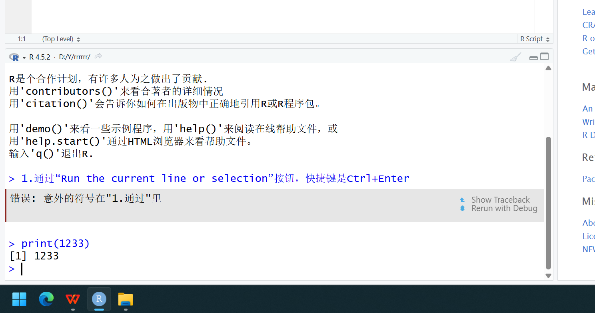
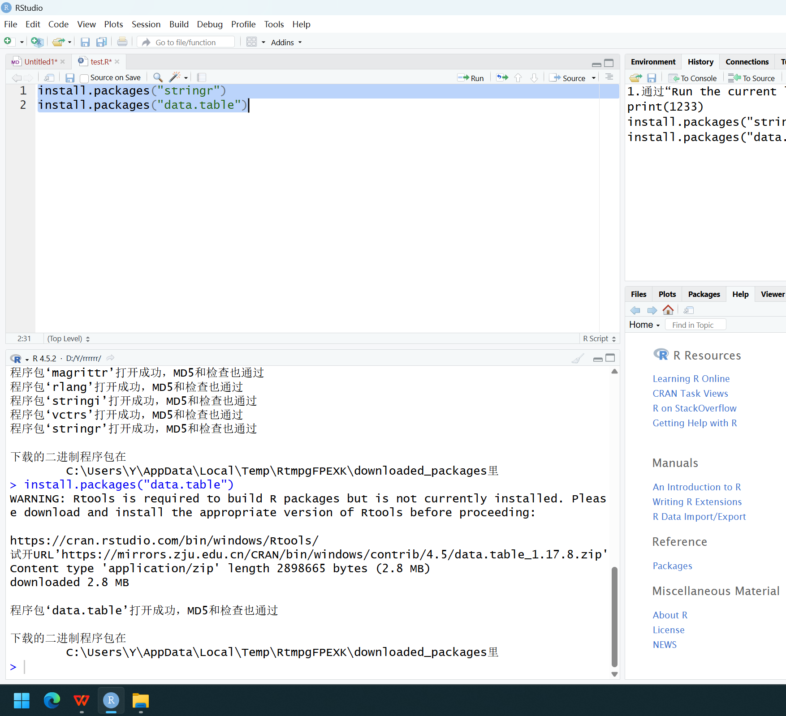
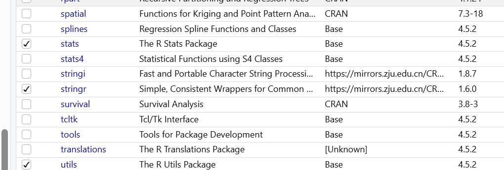
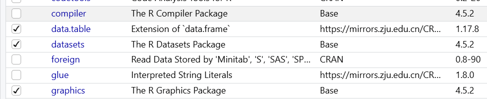
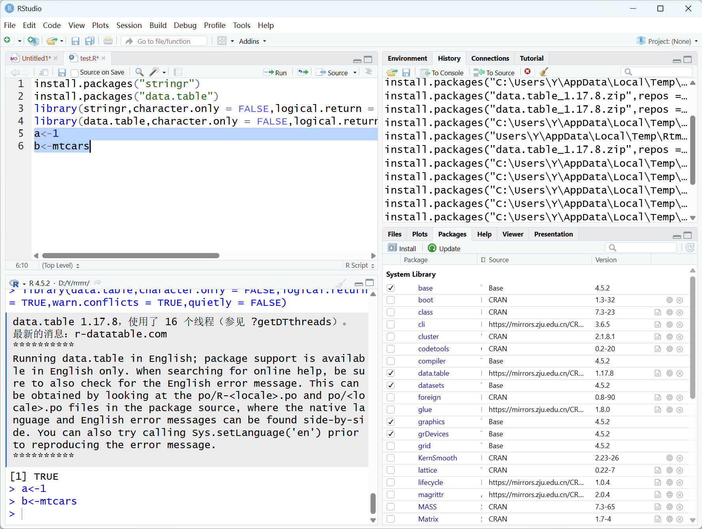
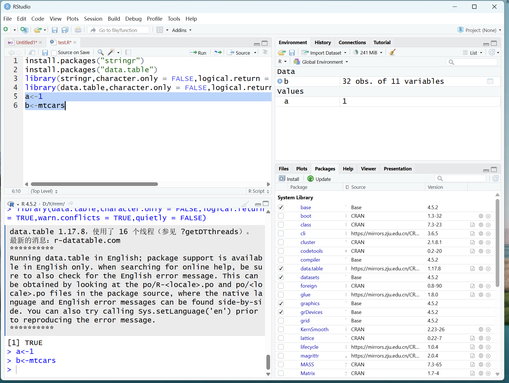

1.通过“Run the current line or selection”按钮，快捷键是Ctrl+Enter

2.还可以在控制台窗口运行代码。

3.利用函数“install.packages”来下载。

4.运用“library（）”函数，packages界面可看。

5.包只需要安装一次，下次打开相关文件不需要再次安装，但需要再次导入。

6.R语言赋值的符号是"\<-",快捷键是“Alt+-”。

7.可在右侧“Environment”窗口查看已赋值情况。

8.注释符号为“#”，快捷键为“Ctrl+Shift+C”。
